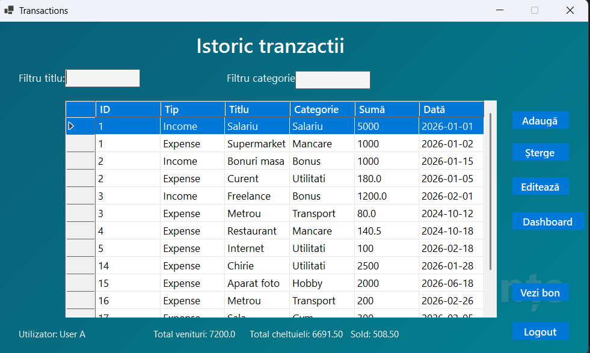

# Personal Finance Manager

A desktop personal finance management application built with **C# (.NET 8)** and **Windows Forms**. The application enables users to manage income and expenses, organize transactions by category, scan receipts using OCR technology, and export financial data to CSV format.

---

## Features

- User authentication (Login & Register)
- Income and expense management (CRUD)
- Dynamic transaction categories
- Receipt OCR powered by Tesseract OCR
- Local JSON data storage
- CSV export
- Transaction filtering and sorting
- Input validation

---

## Screenshots

### Login


### Transactions



### OCR Receipt


---

## Technologies

- C#
- .NET 8
- Windows Forms
- System.Text.Json
- Tesseract OCR
- Regex
- LINQ

---

## Project Structure

```text
PersonalFinanceManager
├── Forms
├── Models
├── Services
├── Storage
├── tessdata
├── screenshots
└── Program.cs
```

---

## Getting Started

### Requirements

- Visual Studio 2022
- .NET 8 SDK

### Installation

Clone the repository:

```bash
git clone https://github.com/Andrei1811/PersonalFinanceManager.git
```

Open the solution in Visual Studio, restore the NuGet packages, and run the project.

---

## OCR Workflow

```text
Receipt Image
      ↓
Tesseract OCR
      ↓
Text Extraction
      ↓
Regex Processing
      ↓
Automatic Form Completion
```

---

## Project Highlights

- Built with C# (.NET 8) and Windows Forms
- Object-Oriented Programming (OOP) architecture
- Local JSON persistence using System.Text.Json
- OCR receipt scanning powered by Tesseract OCR
- Automatic receipt date and total extraction using Regex
- CSV export for transaction history
- Modular architecture based on Forms, Models, and Services

---

## Future Improvements

- SQL Server or SQLite integration
- Password hashing
- Charts and financial analytics
- Cloud synchronization

---

## Author

**Andrei Răulea**

Master's Degree Project – Lucian Blaga University of Sibiu
