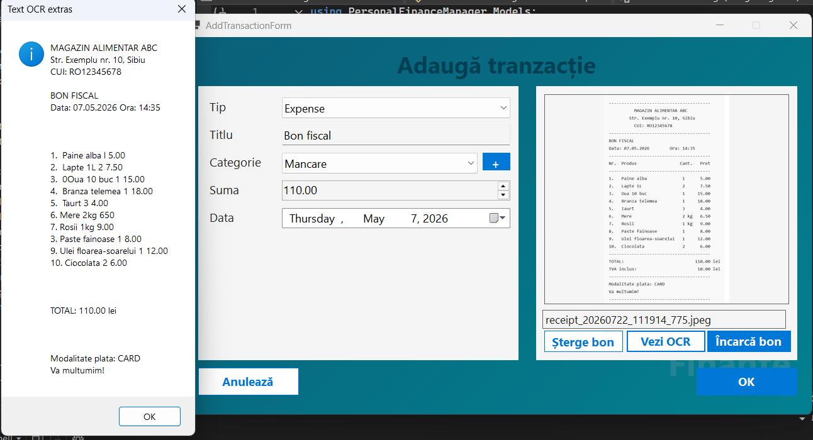

# Personal Finance Manager

A desktop application for personal finance management developed in **C# (.NET 8)** using **Windows Forms**.

The application helps users manage their income and expenses, organize transactions by category, scan receipts using OCR, and export financial reports to CSV format.

---

## Features

- User authentication (Login & Register)
- Income and expense management (CRUD)
- Dynamic categories
- Receipt OCR using Tesseract OCR
- Local JSON data storage
- CSV export
- Transaction filtering and sorting
- Input validation

---

## Screenshots

### Login


### Transactions


### OCR Receipt



## Technologies

- C#
- .NET 8
- Windows Forms
- System.Text.Json
- Tesseract OCR
- Regex
- LINQ

---

## Project Structure

```text
PersonalFinanceManager
├── Forms
├── Models
├── Services
├── Storage
├── tessdata
└── Program.cs
```

---

## Getting Started

### Requirements

- Visual Studio 2022
- .NET 8 SDK

### Installation

```bash
git clone https://github.com/Andrei1811/PersonalFinanceManager.git
```

Open the solution in Visual Studio, restore the NuGet packages and run the project.

---

## OCR Workflow

```text
Receipt Image
      ↓
Tesseract OCR
      ↓
Text Extraction
      ↓
Regex
      ↓
Automatic Form Completion
```

---

## Project Highlights

- Desktop application developed with C# and Windows Forms.
- Object-Oriented Programming (OOP) architecture.
- Local JSON data persistence using System.Text.Json.
- Receipt OCR integration using Tesseract OCR.
- Automatic extraction of receipt date and total using Regex.
- CSV export functionality.
- Clean and modular project structure based on Models, Services and Forms.


## Future Improvements

- SQL Server or SQLite integration
- Password hashing
- Charts and analytics
- Cloud synchronization

---

## Author

**Andrei Răulea**

Master's Degree Project – Lucian Blaga University of Sibiu
